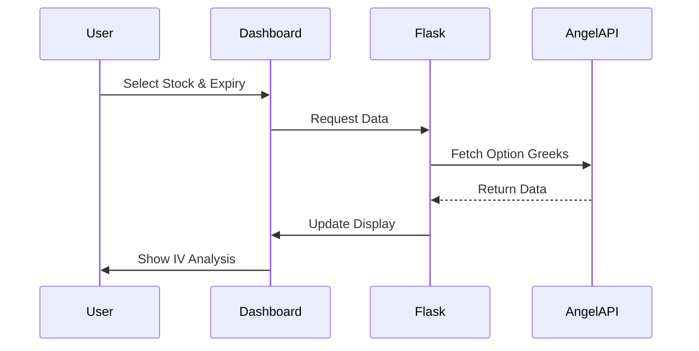

# Options IV Dashboard 🚀

A user-friendly dashboard to visualize and analyze Options Implied Volatility (IV) data from Angel Broking's Smart API.

```ascii
+--------------------+        +-----------------+        +-------------------+
|                    |        |                 |        |                  |
|  Angel Broking API |<------>| Flask Backend  |<------>|  Web Dashboard   |
|                    |        |                 |        |                  |
+--------------------+        +-----------------+        +-------------------+
         ^                           |                          |
         |                           v                          v
         |                    +-----------------+        +-------------------+
         |                    |   Data Store    |        |  Interactive UI  |
         |                    |    (JSON)       |        |   & Charting    |
         |                    +-----------------+        +-------------------+
         |
         v
+--------------------+
|   Options Data     |
|   & Greeks Info    |
+--------------------+
```

## 🌟 Features

- Real-time options data fetching
- IV (Implied Volatility) visualization
- User-friendly web interface
- Stock and expiry date selection
- Automated data updates
- Token mapping and filtering

## 🛠️ How It Works



## 🔑 API Authentication Flow

1. Initialize SmartConnect:
```python
obj = SmartConnect(api_key=api_key)
```

2. Generate TOTP for 2FA:
```python
token = pyotp.TOTP(totp_secret).now()
```

3. Create Session:
```python
data = obj.generateSession(client_code, password, token)
```

## 📁 Project Structure

```
OptionsIV-Dashboard/
├── algoDashboard/
│   ├── app.py           # Main Flask application
│   ├── keys.py          # API credentials
│   ├── data/            # Data storage
│   │   ├── IVjsons/    # Options data
│   │   └── memoryData/  # Token mapping
│   ├── static/          # CSS files
│   └── templates/       # HTML templates
├── docs/
│   └── setup_guide.md   # Setup instructions
└── requirements.txt     # Dependencies
```

## 🚀 Getting Started

1. Clone the repository
2. Install dependencies:
   ```bash
   pip install -r requirements.txt
   ```
3. Configure API credentials in `algoDashboard/keys.py`:
   ```python
   api_key = "YOUR_API_KEY"
   client_code = "YOUR_CLIENT_CODE"
   password = "YOUR_PASSWORD"
   totp_secret = "YOUR_TOTP_SECRET"
   ```
4. Run the application:
   ```bash
   cd algoDashboard
   python app.py
   ```
5. Open browser and visit: `http://localhost:5006`

## 🔄 Data Flow Explained

1. **Token Map Initialization**
   - Fetches master data from Angel Broking
   - Filters stocks based on predefined list
   - Saves mapping to CSV for quick access

2. **User Selection**
   - Choose stock from dropdown
   - Select expiry date
   - Interface updates dynamically

3. **Data Fetching**
   - Application checks local JSON storage
   - If data exists, loads from cache
   - If not, fetches from API
   - Updates every minute

4. **Display & Analysis**
   - Shows IV data in readable format
   - Updates charts in real-time
   - Provides quick analysis tools

## 📝 API Functions

Key functions explained like you're 5:
- `intializeSymbolTokenMap()`: Makes a list of all stocks and their special numbers (tokens)
- `get_valid_expiry_dates()`: Finds out which days you can trade options for a stock
- `fetch_option_greeks()`: Gets special math numbers that tell us about the option's price
- `get_data()`: Gives us all the information we collected to show on the screen

## 🏃‍♂️ Background Tasks

The application runs two main things at once:
1. A web page where you can see everything
2. A helper that keeps getting new information from the stock market

## 🔍 Error Handling

The app is like a careful parent:
- Checks if your login information is correct
- Makes sure the data folders exist
- Keeps track of any problems in log files
- Tells you if something goes wrong

## 📈 Usage Tips

1. Start by selecting a stock from the dropdown
2. Choose an expiry date
3. Wait for the data to load
4. Explore the IV analysis
5. Data updates automatically

